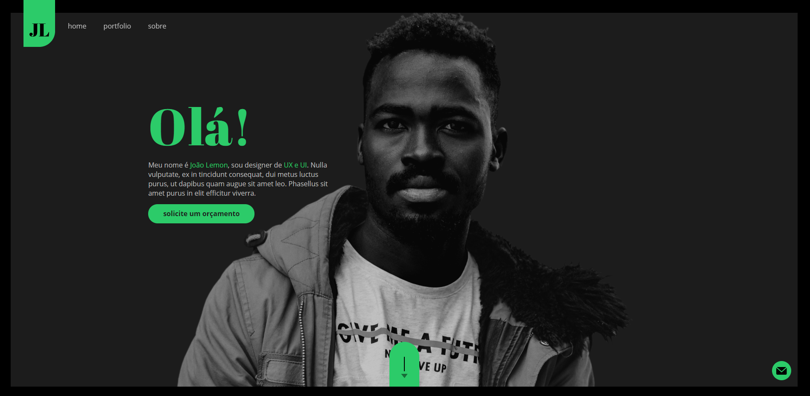

<h1>Portfolio | João Lemon</h1>

<h2>🎨 Layout</h2>

 

 

<h2>💻Projeto</h2>

Esse site consiste em um website do tipo portfolio, elaborado durante o curso de Front-End Designer Essencial na plataforma de estudo Udemy.
